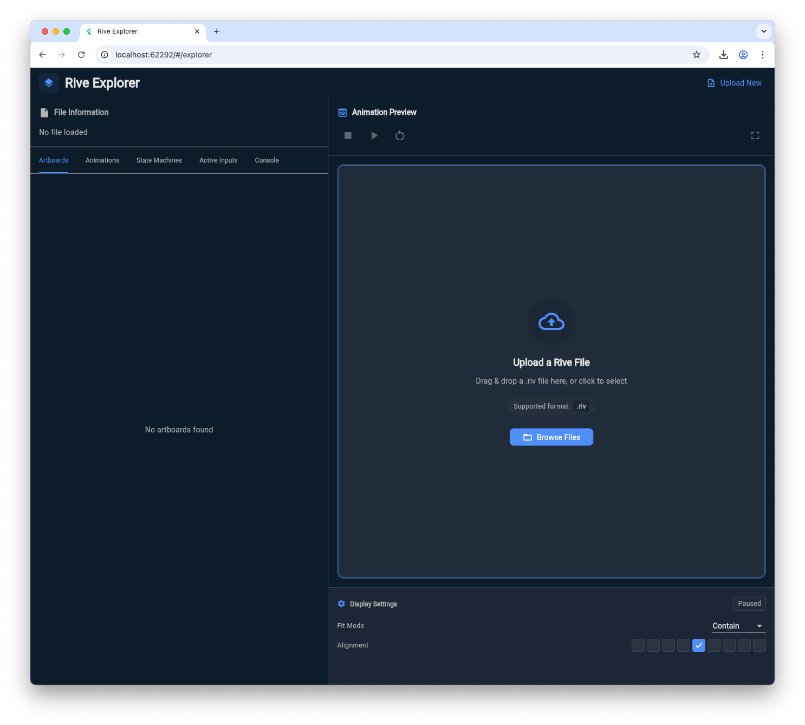

# rive_explorer

This is a Rive file explorer inspired by https://rive.rip.

I found that using Flutter, the files load a bit differently, for example font support and Vector Feathering among other things have different levels of support.

Furthermore, I also wanted better control in exploring all the contents of the file.

## Platform support

Although this project has folders for iOS and Android, it has only been tested and built for web use at this point.